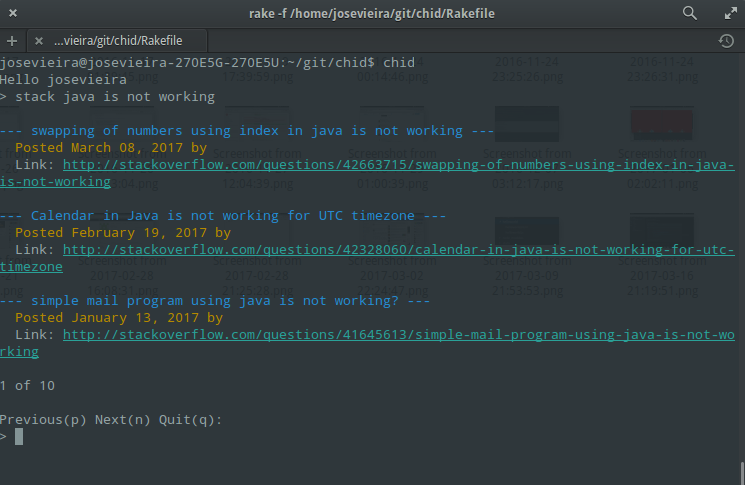

# Chid
Chid is an assistant to help your day-to-day life. It can be used in some 
installations, news, configurations, workstations and more.


## Installation

### Via Gem

```bash
$ gem install chid
```

#### Initialize the chid config file

```bash
$ chid init
```

Creates a .chid.config file on root directory if none `~/.chid.config` file exists.

To access that file will be created in `~/.chid.config`

## Upgrading

To update the chid is easy.

```bash
$ gem update chid
```

## Usage

**Chid** is an gem app based on **Commands**. You are available to use all features running on **terminal**:

To see all commands and how to use on Terminal, run:

`$ chid -h`

**Note:** All Commands are available for **osx** and **linux**. The *chid* will automatically 
knows how run the specific **comand** for each plataform.

All features are listed bellow:  

### Install chid configuration

* `$ chid init` - Will install all necessary confiuration.

### Chid configuration

* `$ chid config` - Open the **.chid.config** file using any source you want. By default is **vim**.
* `$ chid config -editor vim`

### Feature Commands

- [Git Commit](#git-commit)
- [Install apps](#install-apps)
- [Run apps](#run)
- [currency](#currency) 
- [News](#news)
- [Search on StackOverflow](#search-on-stackOverflow)
- [Search GitHub repositories](#search-gitHub-repositories)
- [Workstations](#workstations)
- [Tmux](#tmux)
- [Configure and customize your workstations](#configure-workstation)
 
### <a name="git-commit"></a> Git Commit

Create a commits in based on gitFlow pattern.

* `$ chid commit` - Start the process of commiting
* `$ chid commit -h` - To see all options you can use as shortcut

#### An easy way to create commits following simple steps:

**First**:
  Choose your commit type in this options (add,Remove, Update, Refactor, Fix)

**Second**:
  Type your commit title, a brief description of your changes

**Third**:
  Add your description lines, describing exactly what you did

Thats it! Your commit will be created and pushed like this sample:

```YAML
feature/#123 Add specific file needed to app

- specific file have now this line
- this is the description line two

Signed-off-by: "YourName" "yourEmail@mail.com"
```

### <a name="install-apps"></a> Install apps

**Note:** All install tasks, chid will always ask if you really want to install it. Also 
will install the dependencies if necessary.

* `$ chid install dotfiles` - Install [YADR Dotfiles](https://github.com/skwp/dotfiles)
* `$ chid install node` - Install Node
* `$ chid install postgres` - Install Postgres
* `$ chid install rvm` - Install stable RVM version
* `$ chid install vim and/or gvim` - Install Vim

### <a name="run"></a> Run

* `run postgres` - Run the postgresql if you already have installed.

### <a name="currency"></a> Currency

* `$ chid currency now` - Get the now converstion. Default -from USD -to BRL
* `$ chid currency list` - All list of available Source to use on `now` and `convert commands`
* `$ chid currency convert -amount [amount]` - You can convert an amount between types. Default -to BRL, -from USD 

### <a name="news"></a> News

* `$ chid news` - Will show all news from some sites. BBC news, CNN, Espn, 
Mashable, Google, Techcrunch, Reddit

### <a name="search-on-stackOverflow"></a> Search on StackOverflow


A simple search in StackOverflow 

* `$ chid stack -search [TEXT_TO_SEACH]` - Will search on StackOverflow all results for that 
text.

<p align="left">
  
</p>

### <a name="search-gitHub-repositories"></a> Search GitHub repositories

A simple search for repository name

* `$ chid github -name [SEARCH_EXPRESSION]` - Show results for expression paginated every 10
    
### <a name="workstations"></a> Workstations

Workstations are a way to make it easy for you to open a set of applications by 
simple commands.

The set of configurations are saved on **.chid.config** file.

**Note:** All commands bellow is possible run with prefix: `$ chid workstation [command]` 

* `$ chid workstation list` - List all workstations
* `$ chid workstation create` - Create a new workstation. Chid will ask for a name to set the 
new workstation and after that will list all **applications** available on your 
system to chosse witch one you wanna add
* `$ chid workstation destroy` - Chid will ask which workstation you want to destroy and chid 
will destroy it after choose
* `$ chid workstation open` - Open a specific workstation. Chid will list all workstations to 
choose one of them to open all applications
* `$ chid workstation open -name [workstation_name]` - Open a specific workstation without choose 
from a list. Eg.: `$ chid workstation open -name base` - It will open all applications inside the 
**base** workstation


**Note:** For linux users the `$chid workstation create` is not working. You need create 
manually (editing the .chid.config file). Will be explained how on
**How configure and customize your workstations** topic

### <a name="tmux"></a> Tmux

If you use Tmux as I do for development, this is a nice Command Feature!

This feature is based on some templates you will create on `~/.chid.config` file to open easily all your Dev Env

This Feature have **2** commands, `list` and `open`

* `$ chid tmux list` - List all existent tmux template
* `$ chid tmux create` - Open a specific tmux template

#### An example of Template you will add on **~/.chid.config**:

```YAML
---
:chid:
  :workstations: {}
  :tmux_templates:
    :NAME_YOUR_PROJECT:
    - tmux new -s $$template_name$$ -n app -d;
    - tmux send-keys -t $$template_name$$ 'cd DIRECTORY_PROJECT_PATH'
      C-m;
    - tmux send-keys -t $$template_name$$ 'vim' C-m C-m;
    - tmux new-window -n tests -t $$template_name$$;
    - tmux send-keys -t $$template_name$$ 'cd DIRECTORY_PROJECT_PATH'
      C-m;
    - tmux new-window -n server -t $$template_name$$;
    - tmux send-keys -t $$template_name$$ 'cd DIRECTORY_PROJECT_PATH'
      C-m;
    - tmux attach -t $$template_name$$;
```

The example above each line is a tmux command. You can do what you need. In this case we have only two variables to replace:
- NAME_YOUR_PROJECT -> the name which will appear on `tmux list`
- DIRECTORY_PROJECT_PATH -> the full path of the your directory project. Ex.: `~/Workspaces/ruby-workspace/chid/`

The commands above means those steps:  
1- Create a new Tmux session with `app` name for the first tab or Find an existent one and Open it  
2- Open the folder project on the tmux tab `app`  
3- Open a new tab called `vim` and open the vim on the folder project  
4- Open a new tab called `server` and go to the folder project  

**base** workstation

## <a name="configure-workstation"></a> How configure and customize your workstations

The chid configuration file is installed on **~/.chid.config**. You can open: `$ chid config`

Chid config is a **YAML** file.

You can create the workstations just adding on :workstations: key.

The initial chid config file will be like:

```YAML
---
:chid:
  :workstations: {}
  :tmux_templates: {}
```

#### Base configuration

To add a new *workstation* you can edit like:

```YAML
---
:chid:
  :workstations:
    :base: # Workstation Name
    - iTerm #Application Name
    - Safari
    - Slack
  :tmux_templates: {}
```

After edit you can open the **base** workstation running:

* `$ chid workstation open -name base`
* `$ chid workstation open -n base`


#### Advance configuration

Is possible you can customize some options with each Application when will open it

 - Open the Terminal in a specific folder  
 - Open a Safari with a specific URL
 - Any options which your application can use

```YAML
---
:chid:
  :workstations:
    :base: # Workstation Name
    - iTerm ~/Workspaces/rake-workspace/chid/ & rspec  # Will open 
    # in a specific folder and will run the rspec (run all tests)
    - Safari https://github.com/rachidcalazans/chid # Will open the Safari 
    # in a specific URL
  :tmux_templates: {}
```


